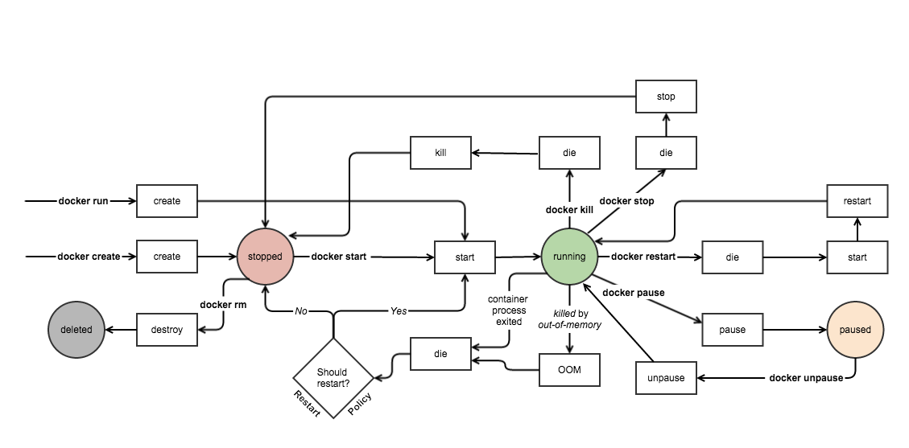

Source: [https://twitter.com/pierrecdn/status/620587662928424960](https://twitter.com/pierrecdn/status/620587662928424960)

- **docker create** command will create a new Docker container with the specified docker image.
  ```bash
     docker create --name <container name> <image name>
  ```
- **docker start** command can be used to start a stopped container.
  ```bash
  docker start <container name>
  ```
- **docker run** command does the work of both **docker create** and **docker start** command.
  ```bash
  docker run -it --name <container name> <image name>
  ```
- **docker pause** command can be used to pause the processes running inside the container (a SIGSTOP signal will be sent to the main process).
  ```bash
  docker pause <container name>
  ```
- **docker unpause** command allows to unpause the container.
  ```bash
     docker unpause <container name>
  ```
- **docker stop** command can be used to stop all the processes running in the container: the main process inside the container receives a SIGTERM signal.
  ```bash
     docker stop <container name>
  ```
- **docker rm** command is used to destroy a stopped container (with `--force` option you can destroy a running container, but it's better to stop it before)
  ```bash
  docker rm <container name>
  ```
- **docker kill** command will kill all the processes in the container: the main process will be sent a SIGKILL or any signal specified with option `–signal`.
  ```bash
     docker unpause <container name>  
  ```

## Docker command syntax

Prior to version 1.13, Docker had only the previously mentioned command syntax. Later on, the command-line was restructured to have the following syntax:

```bash
docker <object> <command> <options>
```

In this syntax:

- `object` indicates the type of Docker object you'll be manipulating. This can be a container, image, network or volume object.
- `command` indicates the task to be carried out by the daemon, that is the run command.
- `options` can be any valid parameter that can override the default behavior of the command, like the `--publish` option for port mapping.

The commands in the previous sections can be re-written as `docker container <command>`, e.g. `docker container create` or `docker container run`.

To learn more about the available commands, visit the official [documentation](https://docs.docker.com/engine/reference/commandline/cli/){:target=_blank}.
