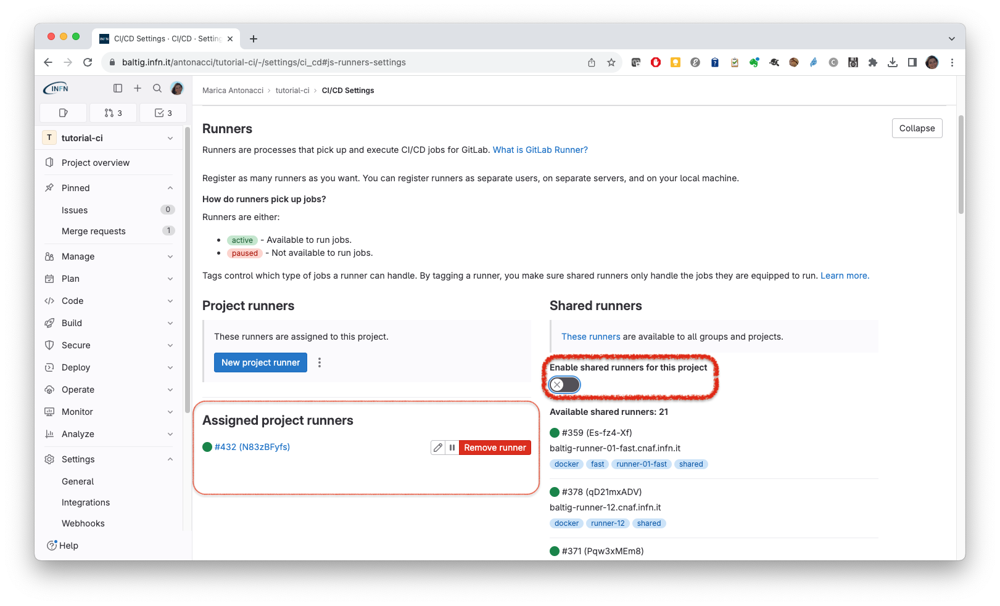

In this section we will add a dedicated GitLab runner to the CI/CD infrastructure. The runner will execute inside a docker container.

1. Create the docker volume:
   ````
   docker volume create gitlab-runner-config
   ````
2. Start the GitLab runner container using the volume we have just created:
   ````
   docker run -d --name gitlab-runner --restart always \
   -v /var/run/docker.sock:/var/run/docker.sock \
   -v gitlab-runner-config:/etc/gitlab-runner \
   gitlab/gitlab-runner:latest 
   ````
   Check your container is running:
   ```
   docker ps
   CONTAINER ID   IMAGE                         COMMAND                  CREATED         STATUS         PORTS     NAMES
   94f0a1bdc4de   gitlab/gitlab-runner:latest   "/usr/bin/dumb-init …"   6 minutes ago   Up 5 minutes             gitlab-runner
   ```

3. Register the runner
       1. Obtain a token:
          Visit your project web page (at `https://baltig.infn.it/USERNAME/tutorial-ci`) and go to **Settings > CI/CD** and expand the **Runners** section:
          
          Copy the token under the section *Specific runners*:
          
       2. Launch the following command replacing the `***********` with the token you have just copied:
          ```
          docker exec -it gitlab-runner gitlab-runner register -n --url https://baltig.infn.it \
          --registration-token *********** --description "My Docker Runner" \
          --executor docker --docker-image "docker:latest" \
          --docker-volumes /var/run/docker.sock:/var/run/docker.sock
          ```
          If the registration is successful you will get a similar message:
          ```
          Registering runner... succeeded                     runner=**********
          Runner registered successfully. Feel free to start it, but if it's running already the config should be automatically reloaded!
       
          Configuration (with the authentication token) was saved in "/etc/gitlab-runner/config.toml" 
          ```
          and your runner will appear under the specific runners of the project:
          

Now you can disable the shared runners and use your newly created one:


Let's trigger our pipeline. You can commit a change in your repository or trigger it manually from **CI/CD > Pipelines**:


You can also look at the runner logs using the command `docker logs gitlab-runner`:

```
docker logs -f gitlab-runner
Runtime platform                                    arch=amd64 os=linux pid=6 revision=bbcb5aba version=15.3.0
Starting multi-runner from /etc/gitlab-runner/config.toml...  builds=0
Running in system-mode.

Configuration loaded                                builds=0
listen_address not defined, metrics & debug endpoints disabled  builds=0
[session_server].listen_address not defined, session endpoints disabled  builds=0
Configuration loaded                                builds=0
Checking for jobs... received                       job=305485 repo_url=https://baltig.infn.it/antonacci/tutorial-ci.git runner=SaSuFzkt
Job succeeded                                       duration_s=106.117881576 job=305485 project=4875 runner=SaSuFzkt
```  
           
